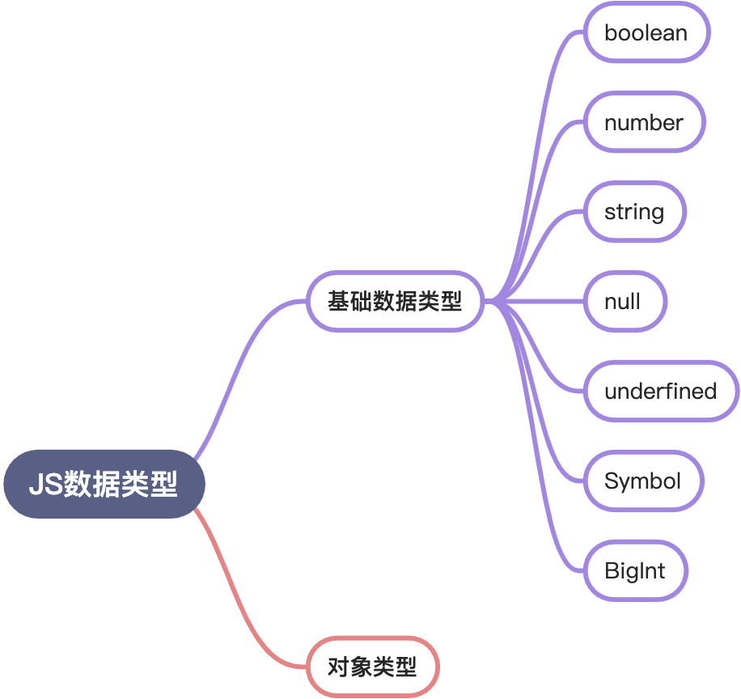

# Typescript基础类型

JavaScript中的类型有：

</img>

## 布尔值boolean
```typescript
let ok:boolean = false
```
这里要注意，使用构造函数Boolean创造出来的不是boolean类型，而是一个对象。
```typescript
let createdByNewBoolean: boolean = new Boolean(1);

// Type 'Boolean' is not assignable to type 'boolean'.
//   'boolean' is a primitive, but 'Boolean' is a wrapper object. Prefer using 'boolean' when possible.
```
但直接调用Boolean是可以返回一个boolean类型的：
```typescript
let createdByBoolean: boolean = Boolean(1);
```
## 数值number
使用`number`定义数值类型：
```typescript
let decLiteral: number = 6;
let hexLiteral: number = 0xf00d;
// ES6 中的二进制表示法
let binaryLiteral: number = 0b1010;
// ES6 中的八进制表示法
let octalLiteral: number = 0o744;
let notANumber: number = NaN;
let infinityNumber: number = Infinity;
```
经过编译之后：
```javascript
var decLiteral = 6;
var hexLiteral = 0xf00d;
// ES6 中的二进制表示法
var binaryLiteral = 10;
// ES6 中的八进制表示法
var octalLiteral = 484;
var notANumber = NaN;
var infinityNumber = Infinity;
```


## 字符串string
使用`string`定义字符串类型：
```typescript
let myName: string = 'Tom';
let myAge: number = 25;

// 模板字符串
let sentence: string = `Hello, my name is ${myName}.
I'll be ${myAge + 1} years old next month.`;
```
编译之后：
```typescript
var myName = 'Tom';
var myAge = 25;
// 模板字符串
var sentence = "Hello, my name is " + myName + ".
I'll be " + (myAge + 1) + " years old next month.";
```


## 空值void
JavaScript中没有空值（`void`），但在TypeScript中，可以用`void`表示没有任何返回值的函数：
```typescript
function alertName():void {
	alert('My name is Ts')
}
```
但声明一个`void`类型变量没有什么用，因为只能把它赋值为`underfined`和`null`：
```typescript
let unable:void = underfined
```
## Null和Underfined
在TypeScript中可以用`null`和`underfined`来定义这两个原始数据类型：
```typescript
let u:underfined = underfined
let n:null = null
```
和`void`不同的是，`underfined`和`null`是所有类型的子类型，即`underfined`类型变量可以赋值给其他基本类型，例如：
```typescript
// 这样不会报错
let num:number = underfined
// 这样也不会报错
let u:underfined
let num:number = u
```
但void类型的变量不可以这样赋值：
```typescript
// Type 'void' is not assignable to type 'number'.
let u:void
let num:number = u
```
