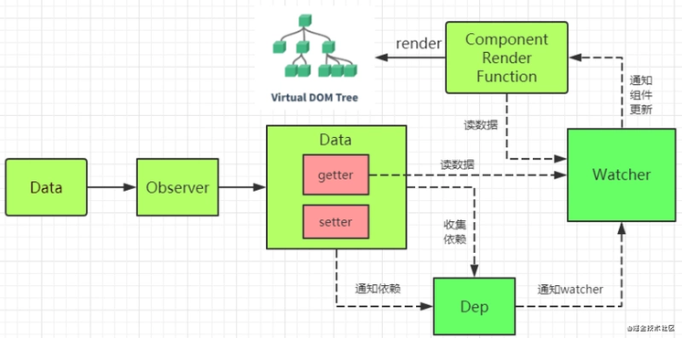
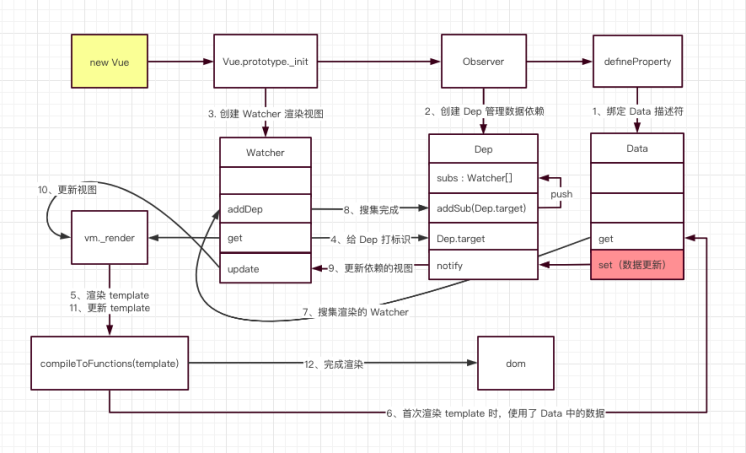
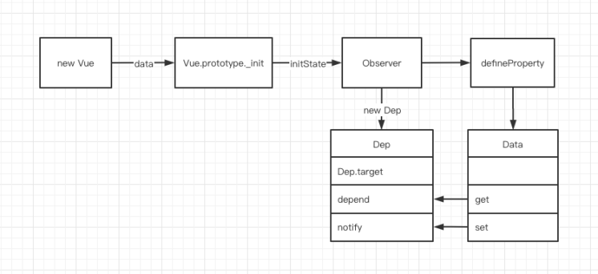

# Vue响应式原理
<a name="apKb6"></a>
## 一句话总结
Vue初始化时会使用`Object.defineProperty()`给data中的每一个属性添加`getter`和`setter`，同时创建`dep`和`watcher`进行**依赖收集**和**派发更新**，最后通过`diff`算法对比新旧vnode差异，通过`patch`即时更新DOM。<br />

</img>


<a name="BsA2P"></a>
## Vue响应式原理详解
**注：此处参考自**[图解 Vue 响应式原理](https://juejin.cn/post/6857669921166491662)<br />
<br />

</img>

<a name="z8lFo"></a>
### 整体流程

- 从 `new Vue` 开始，首先通过 `get`、`set` 监听 `Data `中的数据变化，同时创建` Dep` 用来搜集使用该` Data `的 `Watcher`。
- 编译模板，创建 `Watcher`，并将 `Dep.target `标识为当前 `Watcher`。
- 编译模板时，如果使用到了 `Data `中的数据，就会触发` Data` 的 `get` 方法，然后调用 `Dep.addSub` 将 `Watcher` 搜集起来。
- 数据更新时，会触发 `Data` 的 `set` 方法，然后调用 `Dep.notify` 通知所有使用到该` Data` 的 `Watcher` 去更新 DOM。


<br />下面是一段最简单的Vue代码：

```js
<template>
  <div>
    {{ message }}
  </div>
</template>
<script>
new Vue({
  data() {
    return {
      message: "hello world",
    };
  },
});
</script>

```

代码很简单，但是如何实现打印出`hello word`的？从源头` new Vue`开始分析：<br />

<a name="u4bKo"></a>
### 数据处理
<a name="5V3s3"></a>
#### 流程
Vue 通过 `defineProperty` 完成了 Data 中所有数据的代理，当数据触发 get 查询时，会将当前的` Watcher `对象加入到依赖收集池` Dep` 中，当数据` Data `变化时，会触发` set `通知所有使用到这个 Data 的` Watcher `对象去 `update` 视图。<br />
<br />**注：`Object.keys` 返回一个所有元素为字符串的数组，其元素来自于从给定的`object`上面可直接枚举的属性。这些属性的顺序与手动遍历该对象属性时的一致。**<br />下面继续看代码：
```javascript
// 执行 new Vue 时会依次执行以下方法
// 1. Vue.prototype._init(option)
// 2. initState(vm)
// 3. observe(vm._data)
// 4. new Observer(data)

// 5. 调用 walk 方法，遍历 data 中的每一个属性，监听数据的变化。
function walk(obj) {
  const keys = Object.keys(obj);
  for (let i = 0; i < keys.length; i++) {
    defineReactive(obj, keys[i]);
  }
}

// 6. 执行 defineProperty 监听数据读取和设置。
function defineReactive(obj, key, val) {
  // 为每个属性创建 Dep（依赖搜集的容器，后文会讲）
  const dep = new Dep();
  // 绑定 get、set
  Object.defineProperty(obj, key, {
    get() {
      const value = val;
      // 如果有 target 标识，则进行依赖搜集
      if (Dep.target) {
        dep.depend();
      }
      return value;
    },
    set(newVal) {
      val = newVal;
      // 修改数据时，通知页面重新渲染
      dep.notify();
    },
  });
}

```

数据描述符绑定完成后，下图的流程也就走完了

</img>

<br />如图，Vue初始化时，进行了数据的get、set绑定，并创建了一个Dep对象。<br />
<br />Dep对象用于依赖收集，它实现了一个发布订阅模式，完成了数据`Data`和渲染视图`Watcher`的订阅
```typescript
class Dep {
  // 根据 ts 类型提示，我们可以得出 Dep.target 是一个 Watcher 类型。
  static target: ?Watcher;
  // subs 存放搜集到的 Watcher 对象集合
  subs: Array<Watcher>;
  constructor() {
    this.subs = [];
  }
  addSub(sub: Watcher) {
    // 搜集所有使用到这个 data 的 Watcher 对象。
    this.subs.push(sub);
  }
  depend() {
    if (Dep.target) {
      // 搜集依赖，最终会调用上面的 addSub 方法
      Dep.target.addDep(this);
    }
  }
  notify() {
    const subs = this.subs.slice();
    for (let i = 0, l = subs.length; i < l; i++) {
      // 调用对应的 Watcher，更新视图
      subs[i].update();
    }
  }
}

```
上面代码逻辑如图：<br /><br />
<br />然后是`Watcher`代码：
```typescript
class Watcher {
  constructor(vm: Component, expOrFn: string | Function) {
    // 将 vm._render 方法赋值给 getter。
    // 这里的 expOrFn 其实就是 vm._render，后文会讲到。
    this.getter = expOrFn;
    this.value = this.get();
  }
  get() {
    // 给 Dep.target 赋值为当前 Watcher 对象
    Dep.target = this;
    // this.getter 其实就是 vm._render
    // vm._render 用来生成虚拟 dom、执行 dom-diff、更新真实 dom。
    const value = this.getter.call(this.vm, this.vm);
    return value;
  }
  addDep(dep: Dep) {
    // 将当前的 Watcher 添加到 Dep 收集池中
    dep.addSub(this);
  }
  update() {
    // 开启异步队列，批量更新 Watcher
    queueWatcher(this);
  }
  run() {
    // 和初始化一样，会调用 get 方法，更新视图
    const value = this.get();
  }
}
```
从上面可以看到，`Watcher`实现了渲染方法`_render`和`Dep`相关联，初始化 `Watcher `的时候，打上 `Dep.target `标识，然后调用 `get `方法进行页面渲染。加上上文的 `Data`，目前 Data、Dep、Watcher 三者的关系如下：

<br />
<br />综上，整个数据处理的流程为：Vue 通过 `defineProperty` 完成了 Data 中所有数据的代理，当数据触发 get 查询时，会将当前的` Watcher `对象加入到依赖收集池` Dep` 中，当数据` Data `变化时，会触发` set `通知所有使用到这个 Data 的` Watcher `对象去 `update` 视图。流程如下图：<br /><br />
<br />上面流程中Data和Dep都是Vue初始化时创建的，但Watcher是什么时候创建的？
<a name="855b5dcf"></a>
### 模板渲染
<a name="RItiR"></a>
#### 流程
` Watcher` 在 Vue 初始化的阶段创建的，在生命周期中`beforeMount`创建，创建 `Watcher` 时会执行` render `方法，最终将 Vue 代码渲染成真实的 DOM。在 `Data `变化时，会调用` Dep.notify` 方法，随即调用` Watcher` 内部的`update` 方法，此方法会将所有使用到这个 `Data`的 `Watcher` 加入一个队列，并开启一个异步队列进行更新，最终执行 `_render` 方法完成页面更新。

`new Vue`执行到最后，会调用`mount`方法，将Vue实例渲染成DOM
```javascript
// new Vue 执行流程。
// 1. Vue.prototype._init(option)
// 2. vm.$mount(vm.$options.el)
// 3. render = compileToFunctions(template) ，编译 Vue 中的 template 模板，生成 render 方法。
// 4. Vue.prototype.$mount 调用上面的 render 方法挂载 dom。
// 5. mountComponent

// 6. 创建 Watcher 实例
const updateComponent = () => {
  vm._update(vm._render());
};
// 结合上文，我们就能得出，updateComponent 就是传入 Watcher 内部的 getter 方法。
new Watcher(vm, updateComponent);

// 7. new Watcher 会执行 Watcher.get 方法
// 8. Watcher.get 会执行 this.getter.call(vm, vm) ，也就是执行 updateComponent 方法
// 9. updateComponent 会执行 vm._update(vm._render())

// 10. 调用 vm._render 生成虚拟 dom
Vue.prototype._render = function (): VNode {
  const vm: Component = this;
  const { render } = vm.$options;
  let vnode = render.call(vm._renderProxy, vm.$createElement);
  return vnode;
};
// 11. 调用 vm._update(vnode) 渲染虚拟 dom
Vue.prototype._update = function (vnode: VNode) {
  const vm: Component = this;
  if (!prevVnode) {
    // 初次渲染
    vm.$el = vm.__patch__(vm.$el, vnode, hydrating, false);
  } else {
    // 更新
    vm.$el = vm.__patch__(prevVnode, vnode);
  }
};
// 12. vm.__patch__ 方法就是做的 dom diff 比较，然后更新 dom，这里就不展开了。

```
上面代码流程如下：<br /><br />
<br />可以看到，` Watcher` 其实是在 Vue 初始化的阶段创建的，属于生命周期中` beforeMount `的位置创建的，创建 `Watcher` 时会执行` render `方法，最终将 Vue 代码渲染成真实的 DOM。

把上面的流程整合起来：<br /><br />
<br />上面是Vue初始化到渲染DOM的整个过程。但当数据变化时，Vue又如何变化？<br />
<br />在 `Data `变化时，会调用` Dep.notify` 方法，随即调用` Watcher` 内部的` update` 方法，此方法会将所有使用到这个 `Data `的 `Watcher` 加入一个队列，并开启一个异步队列进行更新，最终执行 `_render` 方法完成页面更新。整个流程如下：<br /><br />

<a name="l0QEL"></a>
### 组件渲染
```typescript
// 从模板编译开始，当发现一个自定义组件时，会执行以下函数
// 1. compileToFunctions(template)
// 2. compile(template, options);
// 3. const ast = parse(template.trim(), options)
// 4. const code = generate(ast, options)
// 5. createElement

// 6. createComponent
export function createComponent(
  Ctor: Class<Component> | Function | Object | void,
  data: ?VNodeData,
  context: Component,
  children: ?Array<VNode>,
  tag?: string
): VNode | Array<VNode> | void {
  // $options._base 其实就是全局 Vue 构造函数，在初始化时 initGlobalAPI 中定义的：Vue.options._base = Vue
  const baseCtor = context.$options._base;
  // Ctor 就是 Vue 组件中 <script> 标签下 export 出的对象
  if (isObject(Ctor)) {
    // 将组件中 export 出的对象，继承自 Vue，得到一个构造函数
    // 相当于 Vue.extend(YourComponent)
    Ctor = baseCtor.extend(Ctor);
  }
  const vnode = new VNode(`vue-component-${Ctor.cid}xxx`);
  return vnode;
}

// 7. 实现组件继承 Vue，并调用 Vue._init 方法，进行初始化
Vue.extend = function (extendOptions: Object): Function {
  const Super = this;
  const Sub = function VueComponent(options) {
    // 调用 Vue.prototype._init，之后的流程就和首次加载保持一致
    this._init(options);
  };
  // 原型继承，相当于：Component extends Vue
  Sub.prototype = Object.create(Super.prototype);
  Sub.prototype.constructor = Sub;
  return Sub;
};

```
<br />上图中的蓝色部分就是渲染组件的过程
<a name="FW2j1"></a>
## Vue响应式的限制
<a name="IGqjv"></a>
### 为对象添加新属性
因为**getter/setter**方法是在Vue实例初始化的时候添加的，只有已经存在的属性是响应式的；当为对象添加一个新的属性时，直接添加并不会使这个属性成为响应式。例如：
```javascript
const vm = new Vue({
	data: {
  	formData: {
    	username: 'Ha'
    }
  }
})
vm.formData.name = 'Ge'
```
`username`在`data`中定义，它是响应式的，而`name`并不是。像上面定义一个新属性并不会生效。但有以下几种解决方式：

1. 最简单的就是初始化对象时定义此属性，并把它的值设为`underfined`，后续赋值自然会生效。
```javascript
formData: {
    	username: 'Ha',
      name: underfined
    }
```

2. 可以使用`Object.assign()`来创建一个新的对象然后覆盖原有对象，当需要一次性更新多个属性时，这是最有效的办法
```javascript
vm.formData = Object.assign({}, vm.formData, {name: 'Ge'})
```

3. 最后，Vue还提供了`Vue.set()`方法，可以使用它将属性设置为响应式的
```javascript
Vue.set(vm.formData, 'name', 'Ge')
```
在组件内部也可以使用`this.$set`来调用这个方法。<br />

<a name="FnKG9"></a>
### 设置数组元素
**Vue中不能直接通过索引设置数组元素**，如：
```javascript
const vm = new Vue({
	data: {
  	scores: [99, 98, 54, 78, 88]
  }
})
vm.scores[1]= 86 // error
```
有两种方法可以处理这一问题。<br />一种是使用`.splice()`方法移除旧元素并添加新元素
```javascript
vm.score.splice(1, 1, 86)
```
另一种是使用`Vue.set()`
```javascript
Vue.set(vm.score, 1, 86)
```
两种方法的效果是一样的。<br />

<a name="FEv70"></a>
### 设置数组长度
在JavaScript中，可以设置一个数组的长度，自动让空元素填充数组至该长度或者截掉数组的尾部（具体根据设置的长度比原长度长还是短来决定）。不过这个方法不能用于处理data对象中的数组，因为Vue不能检测到该操作对数组的任何更改。可以用splice代替
```javascript
vm.score.splice(newLength)
```
这一方法只能用于缩短数组，并不能扩展它的长度。
